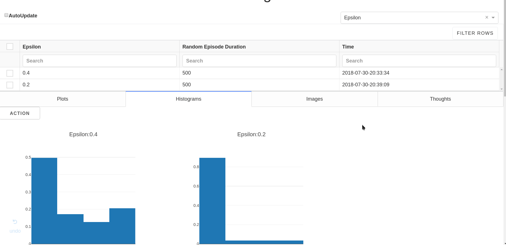
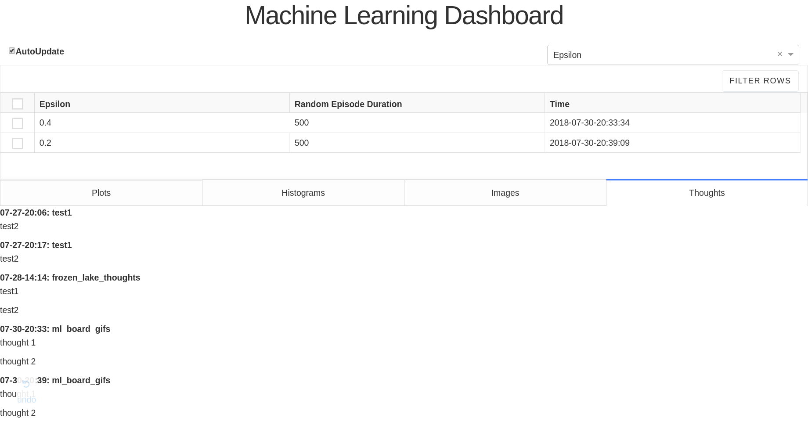

# ml_board
## Why ml_board/Limitations of Tensorboard
I decided to create this machine learning dashboard after using [tensorboardX](https://github.com/lanpa/tensorboardX) for a couple months in training regular neural networks for deep reinforcement learning. As great as tensorboardX was in helping me debug and understand neural networks(it certainly beats printing out statistics to the terminal), I found myself using only a subset of its features, and also discover certain limitations about tensorboard

* **Text is buggy**: The text tab will sometimes take a long time to load, or it will load the text from another run. When training a machine learning model, I often go through many settings and test various hypotheses. Having a reliable log is a must, so that I can know which thoughts goes with which runs.
* **Disconnect between visualization and settings**: My hypotheses often involve varying a hyperparameter and seeing its effect on quantities such as the loss, percentage of activations, etc. But the graphs don't have a legend that tells me which the setting each run used. As a result, I am forced to go back and forth between the Scalars and Text tab, interrupting my train of thought. As an example, if I were to log a bunch of experiments from random search, I would have put in a non-trivial amount of effort to remember which experiment used which setting(since the number won't monotonically increase/decrease as in grid search)
* **Inadequate search**: Suppose I wanted to view all the runs that achieved a certain accuracy, or were run on a particular hyperparameter setting. As far as I know, this is not possible in tensorboard. So in some senses, past runs are only useful if I can remember them.

Although tensorboard has great visualization capabilities(embeddings,computational graphs,etc), it is not the best tool for tracking, presenting, and organizing the knowledge one obtains as they run through many machine learning experiments. So the focus of this project will not be on visualization [tensorboard](https://github.com/tensorflow/tensorboard), or experiment control and reproducibility [sacred](https://github.com/IDSIA/sacred), but on creating a better interface for the scientist to view the relationship between model parameters and its output characteristics.
## Features
* **Interactive Table -> Filters Visualizations**: Allows individual selection of runs, and numerical filtering based on equality/inequality. Once these choices are made, the Plots, Histograms, and Image Tabs are updated accordingly, allowing you to choose which run's visualizations you see. Also, because the plots are plotly Graph objects, one can click on the individual items in the plot legend to remove the corresponding plot from view


* **Legend Dropdown -> Hyperparameter Display**: Allows you to choose the hyperparameter setting(well technically any statistic you wish) to be displayed as the title(or legend) for each run in the Plots/Histogram/Image Tabs. I limited the title to one item because I did not want the figures to be cluttered with words, which I believe is worth the tradeoff of the occasional lack of uniqueness.


* **Figure/AutoUpdate Toggle**: As in tensorboard, you can click on the figure's title to minimize it. Also, every 10 seconds, the app will reread the data from the database, unless the autoupdate toggle is turned off.

* **Log of Thoughts**: As explained later, the user specifies a mongodb database name and mongodb collection(I call them folder) name where the run's statistics will be stored. The intended usage for this is that the user will specify a different folder for every "hypotheses" they want to test. Examples include "debug_binary_loss" or "lr_hyper_tune". The dashboard will only display all the runs in one folder at a time, since visual information takes up a substantial amount of space -> inevitably will lead to scrolling, a flow state killer. The limitations with this is that the user is unable to view the entire progression of their ideas. To preserve this folder-independent, sequential flow of thoughts, the Thoughts Tab aggregates logged thoughts across all folders within the given database and displays them in order by time, and furthermore is labeled by the folder name to give the comments context.




* **Extensibility**: The Dash library comes with awesome interactive components, such as the Table and Tabs components that were used in my project. Because I did not need to write these primitives myself, I could focus my attention on the domain problem/vision at hand, something that Peter Norvig talks about in [As We May Program](https://vimeo.com/215418110) (see 17:50-19:00). Though this is a project geared towards my own personal usage, it can be easily extended(b/c it is written in a language data scientists are intimately familiar with+official tutorial is excellent+great community) by end-users as they see fit. After all, I created this with no prior web app experience!

# Installation
Until the tabs feature is integrated into the master branch of [dash](https://github.com/plotly/dash), and I do more testing, and write up the documentation, you will have to manually install the package with the following commands:
```
git clone https://github.com/bbli/ml_board.git
cd ml_board
conda create -n ml_board python=3.6.6 pip
pip install .
```
After this, install MongoDB(and make sure it is enabled and started) and you are good to go!

If something goes wrong during usage, and you can't debug it, you can try installing the exact versions this package was tested on:
1. Commenting out the `install_requires` field in setup.py
2. run `pip install -r requirements.txt && pip install .`

# Usage
### Logging
Usage is very similar to tensorboard. Difference are:
* No need to specify a count, as ml_board will append the result to a MongoDB list. The other is that ml_board has an additional `add_experiment_parameter` which is intended to log hyperparameters to a table
```
from ml_board import SummaryWriter
w= SummaryWriter('name_of_mongodb_database','name_of_mongo_db_collection')

## These two append to a list
w.add_scalar("example_loss_name",example_loss_value)
w.add_histogram("example_histogram_name",example_loss_value)

w.add_image("example_picture_name",2d_numpy_matrix_in_range_0_to_1)
w.add_thought("example_thoughts")
## the current time is automatically logged as an experiment parameter when you create a SummaryWriter object
w.add_experiment_parameter("example_hyperparameter_name",example_hyperparamter_value)
w.close()
```
For more details, look at the `Logger.py` file in the ml_board folder
### Visualizing
From the command line, enter
```
ml_board --database_name name_of_mongodb_database --folder_name name_of_mongo_db_collection
# shorthand notation
ml_board -db name_of_mongodb_database -f name_of_mongo_db_collection
# specific port. Default 8000
ml_board -db name_of_mongodb_database -f name_of_mongo_db_collection -p 8050
```
### Comments
* If autoUpdate is on, do not filter rows as it will be overwritten
* Don't click on the filter rows button twice, or it will filter permemantly. If this does happen, refresh the webpage to reset the app's state.
* FYI, the Histogram Tab generally takes the longest time to update(b/c multiple plotly Figure objects are created for each histogram name).

# TODO
* allow user to change folders from within the dashboard
* put priority on the callbacks(basically if I am on the Plots Tab, its callbacks should finish first)
* testing/documentation
